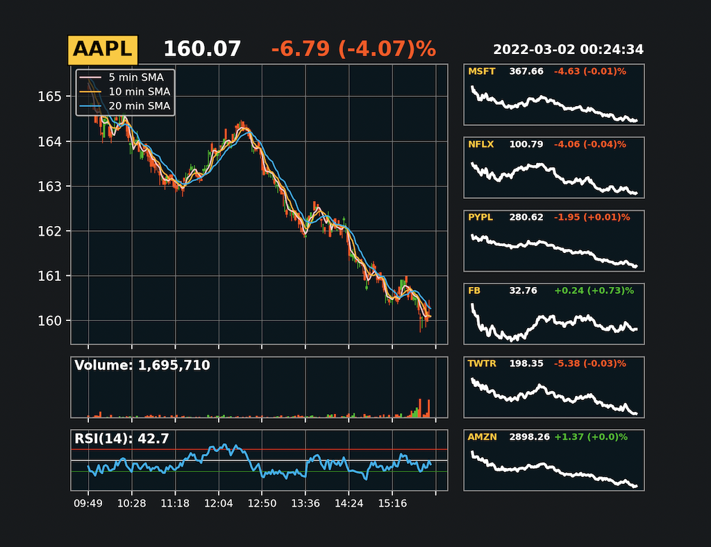

<h1 align="center">Getting Live Financial Data</h1>

## Description

This code is part of a larger project I'm currently working on to get and show real-time stock prices. 
The Data will be scraped from a financial website and saved into a CSV file. Finally, the data will be cleaned
and displayed on a dashboard.

The dashboard will show real-time 7 stock prices. Stock name, current price, regular market price changes, and 
changes in percentages will be displayed for every stock. One of the 7 stocks will have more detailed information, 
such as; price changes in candlestick graphic, 3 SMA lines (5 minutes, 10 minutes, and 20 minutes), volumes, and 
an RSI 14 line.

The project is coded and tested on macOS. Various bugs may occur on different operating systems. Please do not 
hesitate to report if any bugs occur.

## Features

- Scrapping live data from a website:
  - with BeautifulSoup
  - with Selenium
- Save data to a csv file 
- Show real-time stock data:
  - display 7 stocks data in real-time
  - one stock in focus with more details
    - candlestick chart
    - 5, 10, and 20 minutes SMA lines
    - volume related to candlestick
    - rsi line
  - all stocks will have common information displayed:
    - price
    - price changes in real number and percentage
    - color reflecting the current price trend (red / green)

## Update

- 02.03.2022: Minor bug fixes
- 29.01.2022: First Init with basic features

## License

Distributed under the MIT License. Please see **`LICENSE.md`**
for further information

